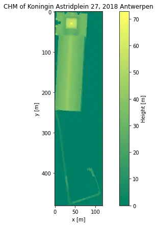
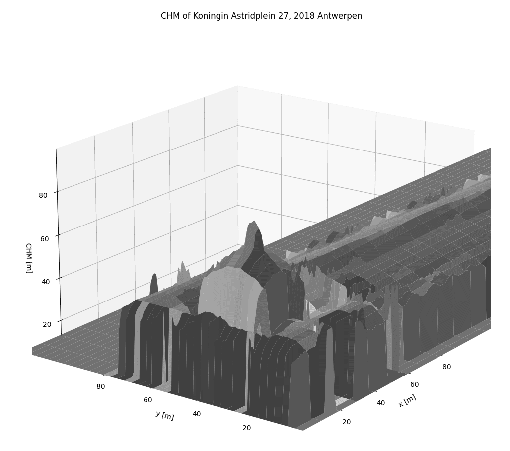

# 3D houses from LiDAR data

In this project, the goal is to create a 3D plot of a house, starting from any address in Flanders.

<!--  -->


There is a working **example** plot in [a Jupyter Notebook](Example.ipynb).

## How it works

The **basic steps** to get to plotting are:

  1. Retrieve the address with an `Address` object. This can be done by filling in the `street`, `number` and `zipcode`/`municipality` arguments. Or, with a small sidestep, you can use the classmethod `Address.from_search()` to look up a more arbitrary address string.
  2. Create a `Building` object, with this address. The class handles then all the data internally, i.e.

     - finding the right _Kaartbladversnijding_ zone,
     - checking if the GeoTIFFs are available locally
     - downloading them if needed,
     - masking the shape of the building
     - calculating the canopy height model

  3. Plot the data. You can either make a 3D plot, with `Building.plot3D()`, or a flat color-coded image with `Building.plot_image()`.

### Tests

There are also some unit tests, mainly for address lookups, in [tests.py](tests.py). Run with

```sh
python -m unittest tests.py
```

### Necessary packages

This project uses [Rasterio](https://rasterio.readthedocs.io/en/latest/), [GeoPandas](https://geopandas.org/), [numpy](https://numpy.org/), [Matplotlib](https://matplotlib.org/).

The easiest way to get this working is with a new Anaconda environment. This should give you all you need (I hope).

```sh
# Create a new conda env, named "houses"
conda create --name houses -c conda-forge python>=3.8 matplotlib rasterio geopandas requests numpy
# activate the env before running the script
conda activate houses
```

## About the data

- The data that is used is sourced from the second edition of the “_Digitaal Hoogtemodel Vlaanderen_” ([DHMV II](https://overheid.vlaanderen.be/informatie-vlaanderen/producten-diensten/digitaal-hoogtemodel-dhmv)) from AGIV.

- The data that is used is sourced from [AGIV](https://overheid.vlaanderen.be/informatie-vlaanderen), a collection of data of Flanders, Belgium, that is freely available.

  - **DSM**: _Digital Surface Model_. The height, including buildings.
  - **DTM**: _Digital Terrain Model_. The 
  - **CHM**: _Canopy Height Model_, DSM - DTM. **What we are interested in**, and what needs to be calculated from the data.

- The TIFF data is divided in zones, as show below. These so-called **[Kaartbladversnijdingen](https://download.vlaanderen.be/Producten/Detail?id=111&title=Kaartbladversnijdingen_NGI_klassieke_reeks#)**: 

  

- For each of these part, a two large GeoTiff files with the DSM and DTM data can be downloaded. 

## Technical details

### Retrieving the address

In order to go further, we first need to connect a coordinate to a given address.
For Flanders, there are two public APIs that provide this service: [api.basisregisters.vlaanderen.be](https://docs.basisregisters.vlaanderen.be/docs/api-documentation.html#tag/api-documentation.html) and [loc.geopunt.be/location](https://loc.geopunt.be/).
Because the former returns more detailed results about the address, which include surrounding polygons for the building, I chose that one.
However, the Geopunt API handles arbitrary lookup strings like “_Street name 11 City_”, so I added a function so that the user can add an address starting from a search string, using this API.

All the address-related code is in the class `Address`.
On initialization the user specifies the address

### Preparing the LiDAR data

TODO

### Creating a 3D plot

I used Matplotlib for the 3D plots.
